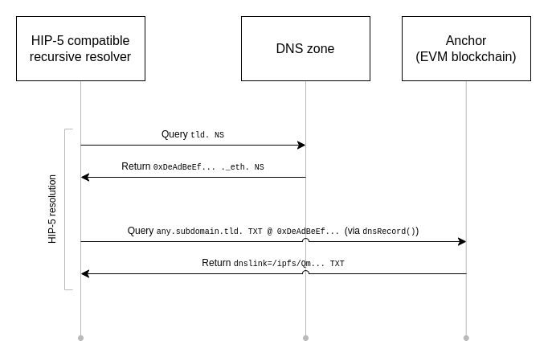

# Anchor

A minimalist smart contract implementation for linking HNS names to IPFS content

## What is Anchor

We can link a domain to IPFS content by using [DNSLink](ipns://docs.ipfs.io/concepts/dnslink/). However, when using with [Handshake](https://handshake.org/) (or some other root zones), there are some limitations

- We can't make subdomains
- We have to trust domain owners (they can always update records)

In Handshake, we can use our domain names with smart contracts by following [HIP-5](https://hsd-dev.org/HIPs/proposals/0005/) standard. A smart contract can store DNS records in subdomains thanks to [EIP-1185](https://eips.ethereum.org/EIPS/eip-1185) standard

This is where Anchor comes in to play. Anchor is a minimalized smart contract to serve DNSLink data for HNS name. Instead of deploying entire ENS system, we can pick only what we use to minimize gas fees

Anchor gives users ability to lock names, so that they will become immutable on-chain. This will only makes sense if the name is also transfed to a [renew-only address](https://github.com/handshake-org/hsd/pull/567) on HNS blockchain. Consider doing this if you are building a decentralized web application (dApp, or dWeb) and not a personal website

Users are supposed to deploy this contract and use it with their own names themselves individually

